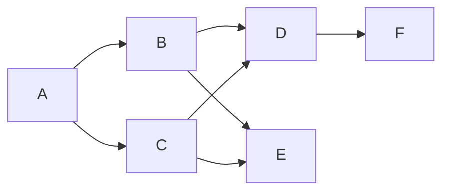

## **题目 # 1**
森林中有兔子一共若干只，它们有若干种类。现从中抽出若干只，每一只兔子会说出森林里它的种类还剩下多少只（假如森林里一共11只白兔子，则每一只抽出的白兔子都会说森林里我这个类别的还有10只）。问这个森林里至少有多少只兔子。
## **题目 # 2**
有有向图如下，输出一种包含所有节点的输出，要求箭头指向的节点出现在箭头出发的节点之后，并且必须按照层次顺序。如A,B,C,D,E,F（D,E不可出现在B,C前）。

